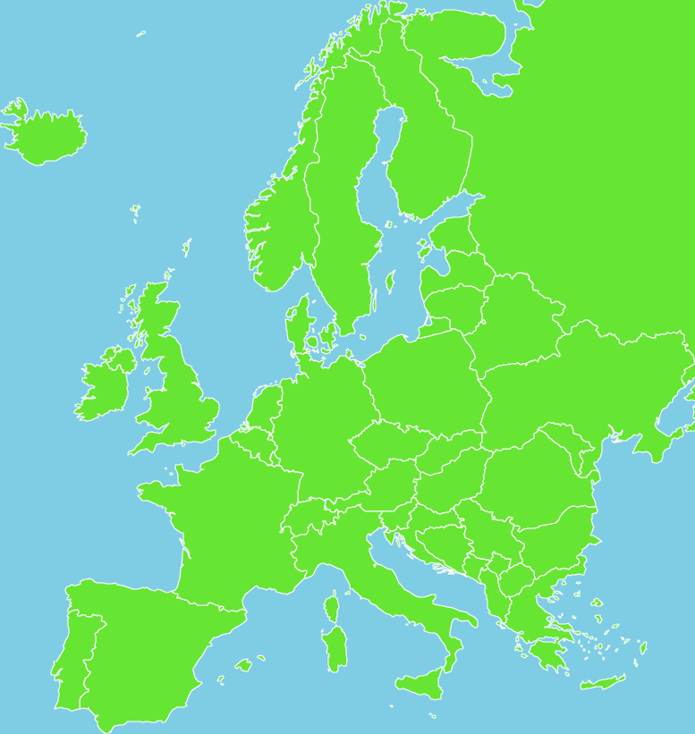

=====
Coral
=====

Coral is a library of digital cartography functions implemented in Python 3.

Examples
--------

The examples bellow use `a public domain shapefile from the Natural Earth project <http://www.naturalearthdata.com/downloads/50m-cultural-vectors/50m-admin-0-countries-2/>`_.
Download it and unzip its contents to a folder named ``data``.

1. Simple map of Africa.

.. code:: python

    from coral import shapefile, tqdm, coord, proj, vector
    
    # Choose projection and scale.
    prj = proj.TransMercator()
    pixsz = 5000 # meters/pixel
    
    # Load shapefile.
    sfpath = "data/ne_50m_admin_0_countries"
    sf = shapefile.Reader(sfpath, encoding='latin1')
    
    # Draw countries to canvas.
    cvs = vector.Canvas()
    for sr in tqdm.tqdm(sf.shapeRecords()):
        # Ignore countries not in Africa.
        if sr.record[54] != "Africa":
            continue
        points = sr.shape.points
        offsets = list(sr.shape.parts) + [len(points)]
        for a, b in zip(offsets[:-1], offsets[1:]):
            # Ignore some small islands.
            if b - a < 50:
                continue
            # Project points.
            polygon = (prj.geo2rect(lon, lat) for lon, lat in points[a:b])
            # Simplify polygons to reduce number of points.
            polygon = coord.simplify(polygon, pixsz)
            cvs.addpolygon(polygon, stroke=0)
    cvs.save("africa.eps")

2. Simple map of Europe with color.

.. code:: python

    from coral import shapefile, tqdm, coord, proj, vector
    
    parallels = 42, 65
    prj = proj.ConicEqualArea(parallels)
    pixsz = 5000
    
    # Define some colors
    land =  0.4, 0.9, 0.2
    border = 1, 1, 1 # this is white
    ocean = 0.5, 0.8, 0.9
    
    sfpath = "data/ne_50m_admin_0_countries"
    sf = shapefile.Reader(sfpath, encoding='latin1')
    
    cvs = vector.Canvas(ocean)
    for sr in tqdm.tqdm(sf.shapeRecords()):
        if sr.record[54] != "Europe":
            continue
        points = sr.shape.points
        offsets = list(sr.shape.parts) + [len(points)]
        for a, b in zip(offsets[:-1], offsets[1:]):
            # Prevent some lands from interfering on the region of interest.
            lon, lat = points[a]
            outside = not -25 < lon < 41 or not 35 < lat < 72
            if outside:
                bb = cvs.bbox
            polygon = (prj.geo2rect(lon, lat) for lon, lat in points[a:b])
            polygon = coord.simplify(polygon, pixsz)
            cvs.addpolygon(polygon, fill=land, stroke=border)
            if outside:
                cvs.bbox = bb
    cvs.save("europe.eps")

License
-------

Coral is released under the MIT License. See LICENSE.rst for more information.
